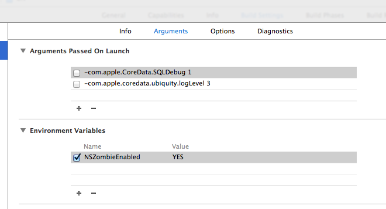

##Coredata

###Scheme variable to see the SQLite queries in log
```
-com.apple.CoreData.SQLDebug 1

-com.apple.coredata.ubiquity.logLevel 3
```

###Zombie enabling for premature memory release - Enviornment variable
```
NSZombieEnabled YES
```


